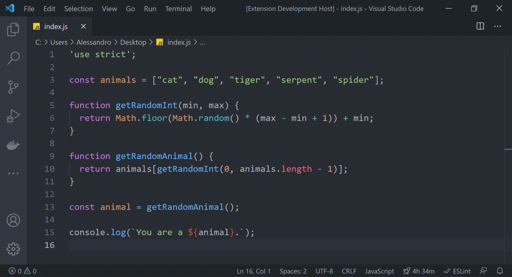
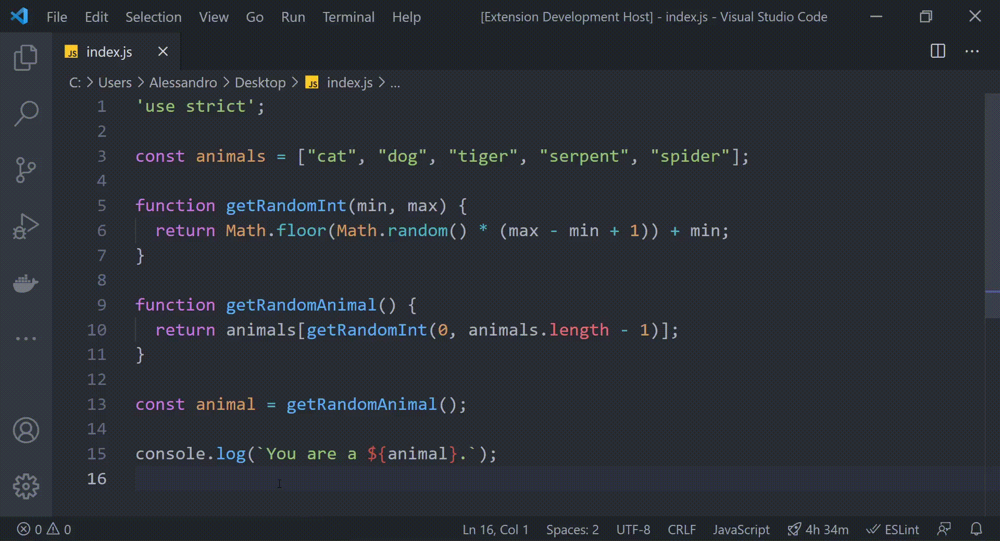

[![Visual Studio Marketplace Version][version-image]][version-url]
[![License][license-image]][license-url]

  

*Share snippet* is a VS Code extension that lets you share code on the fly using [Pastie](http://pastie.org/). It generates a unique link that contains your code and automatically expires after 24 hours.

## Features

### Share selection

1. Select the code you want to share
2. Press `Ctrl + Shift + P` to open the `Command Palette`
3. Choose `Share Snippet: Selected Code`
4. Paste the link wherever you like

### Share file

1. Press `Ctrl + Shift + P` to open the `Command Palette`
2. Choose `Share Snippet: File`
3. Paste the link wherever you like

[version-image]: https://img.shields.io/visual-studio-marketplace/v/AleG94.share-snippet?color=brightgreen&label=Visual%20Studio%20Marketplace
[version-url]: https://marketplace.visualstudio.com/items?itemName=AleG94.share-snippet
[license-image]: https://img.shields.io/badge/License-MIT-green.svg
[license-url]: https://github.com/AleG94/vscode-share-snippet/blob/main/LICENSE
